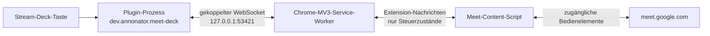

# Architektur

## Zweck und Grenzen

Meet Deck stellt zustandssynchronisierte Stream-Deck-Tasten für ein aktives Google Meet bereit.
Version 1 steuert Mikrofon, Kamera, Handzeichen und die eigene Bildschirmfreigabe. Alles bleibt
lokal: Es gibt weder Meet-API/OAuth noch Backend, Cloud-Relay, Analytics oder Telemetrie.

Die Aufteilung ist notwendig, weil ein Stream-Deck-Plugin keinen Browser-Tab untersuchen kann und
eine Chrome-Erweiterung keine Stream-Deck-SDK-Ereignisse empfängt.

## Wann Bordmittel genügen

Reichen Mikrofon-/Kamera-Kurzbefehle im gerade fokussierten Meet-Tab, ist die eingebaute
Stream-Deck-Aktion **Hotkey** beziehungsweise **Multi Action** die kleinere Lösung ganz ohne
Browser-Erweiterung. Sie kennt jedoch keinen bestätigten Meet-Zustand, folgt Änderungen innerhalb
von Meet nicht, wählt bei mehreren Tabs kein Ziel sicher aus und zeigt die eigene Präsentation nicht
zuverlässig an. Meet Deck ist durch genau diese Anforderungen begründet, nicht als Ersatz für einen
einfachen Kurzbefehl.

Google Meet bietet keine unterstützte öffentliche API für diese interaktiven In-Call-Controls. Die
eng begrenzte Meet-only-Chrome-Erweiterung beobachtet und betätigt deshalb die sichtbare Meet-UI;
Zustimmungsgrenzen von Browser und Betriebssystem bleiben maßgeblich.

## Komponenten

- `packages/protocol` (`@meet-deck/protocol`) enthält das versionierte, streng validierte
  Wire-Protokoll. Frames sind auf 16 KiB begrenzt.
- `apps/streamdeck-plugin` empfängt Tastendrücke, betreibt den Loopback-WebSocket, authentifiziert
  die Erweiterung und zeigt bestätigte Zustände auf allen passenden Tasten. Die UUID lautet
  `dev.annonator.meet-deck`.
- `apps/chrome-extension` ist eine Manifest-V3-Erweiterung. Ihr Service Worker verwaltet die Bridge.
  Das Content Script läuft ausschließlich auf `https://meet.google.com/*`, liest die relevanten
  barrierefreien Zustände und betätigt nur ein eindeutig erkanntes Element.

Die Erweiterung fordert nur `storage` und `alarms` sowie den Meet-spezifischen Content-Script-Match
an. `storage` hält lokales Pairingtoken und Konfiguration. `alarms` plant einen benannten
Wecktermin, damit ein pausierter MV3-Worker die Loopback-Bridge erneut verbinden kann; der Alarm
enthält nur seinen festen Namen und Zeitpunkt, niemals Meeting- oder Steuerdaten. Keine der beiden
Berechtigungen gewährt zusätzlichen Webseitenzugriff. Die Erweiterung fordert weder `tabs`,
`cookies`, `webRequest`, `debugger`, `desktopCapture`, Mikrofon, Kamera noch breiten Hostzugriff an.

## Daten- und Befehlsfluss

1. Jedes Content Script meldet nur, ob sein eigenes Dokument beigetreten ist, sowie dessen endliche
   Steuerzustände.
2. Der Service Worker prüft die vom Browser gelieferte Sender-/Dokumentidentität, führt die
   Tab-Registry, leitet `meetingMultiplicity` ab und sendet den datensparsamen Snapshot über die
   authentifizierte Loopback-Verbindung.
3. Das Plugin aktualisiert Tasten nur nach bestätigten Snapshots. Ein Tastendruck schaltet das Icon
   niemals optimistisch um.
4. Ein Tastendruck erzeugt einen Befehl mit einer zufälligen Korrelations-ID. Das Content Script
   klickt nur ein einziges, exakt unterstütztes Element und beobachtet anschließend den Zustand.
5. Ergebnis und Snapshot bestätigen den Erfolg oder melden einen begrenzten Fehler wie `no_meeting`,
   `ambiguous_target`, `unsupported_ui`, `timeout` oder `needs_user_action`.

Der Snapshot enthält nur `meetingMultiplicity` (`none`, `one`, `multiple`) und endliche Zustände für
Mikrofon, Kamera, Hand und `selfPresentation`. Transportmetadaten ergänzen eine zufällige
Sitzungs-ID und monotone Sequenz. Meet-URL oder -Code, Titel, Teilnehmer, Chat, Untertitel, Audio,
Video und Bildschirminhalt dürfen niemals Teil einer Schicht sein.

## Zielauswahl und sicheres Scheitern

Pre-Join-Seiten sind keine aktiven Meetings. Steuerbefehle sind nur bei genau einem beigetretenen
Meeting erlaubt. Bei mehreren Meetings antwortet Meet Deck mit `ambiguous_target` und klickt nichts.
Fehlende, doppelte, unbekannt übersetzte oder semantisch uneindeutige Elemente führen zu
`unsupported_ui`. Obfuskierte CSS-Klassen sind kein Selektorvertrag.

Der DOM-Adapter nutzt Rollen, exakte unterstützte Accessibility-Namen und Statusattribute der
englischen und deutschen Meet-Oberfläche. Er beobachtet DOM-Änderungen und bewertet den Zustand auch
nach Meet-SPA-Navigation neu.

## Kopplung und lokaler Transport

Das Plugin lauscht ausschließlich auf `127.0.0.1`, standardmäßig Port `53421`. `0.0.0.0`, LAN- und
öffentliche Adressen sind verboten.

Kopplung ist standardmäßig geschlossen. Der Property Inspector öffnet ein zweiminütiges Fenster und
zeigt einen achtstelligen Einmalcode. Nach Eingabe im Extension-Popup stellt das Plugin ein
zufälliges 256-Bit-Token aus. Spätere Verbindungen tauschen frische Client-/Server-Nonces aus und
binden den HMAC-SHA-256-Nachweis an zufällige Sitzung, konkrete `chrome-extension://…`-Origin und
die Rollen Extension/Plugin. Auch das Plugin weist der Erweiterung Tokenbesitz nach. Eine neue
Kopplung ersetzt das zuvor gekoppelte Chrome-Profil. Nach fünf Fehlversuchen muss das Fenster
bewusst neu geöffnet werden.

Nach Authentifizierung liegt jede Anwendungsnachricht in einem geschützten Envelope (`protected`)
mit Sitzung, Richtung, strikt steigender Sequenz je Richtung und MAC. Befehle laufen
Plugin→Extension, Zustände/Ergebnisse Extension→Plugin. Nonces und Sequenzen schützen vor Replay.
Ungültige, zu große, falsch gerichtete, unbekannt versionierte oder strukturell unerwartete
Nachrichten werden verworfen. Token, Pairingcode, Authentifizierungsnachweise und Frame-MACs dürfen
nie geloggt werden.

Ein MV3-Service-Worker darf pausiert werden. Heartbeat und begrenztes exponentielles Reconnect
stellen die Sitzung wieder her, ohne Authentifizierung zu umgehen. Chrome kann für den
Loopback-WebSocket eine Abfrage für Local Network Access (LNA) anzeigen. Wird sie abgelehnt, bleibt
Meet Deck offline; es gibt keinen Cloud-Fallback.

## Grenze der Bildschirmfreigabe

Meet Deck kann den Meet-Freigabefluss öffnen. Die konkrete Auswahl eines Bildschirms, Fensters oder
Tabs bleibt jedoch immer beim Chrome-/macOS-Picker und muss bei jedem Start bestätigt werden. Meet
Deck wählt und erfasst keine Quelle. Ein abgebrochener Picker lässt den Zustand inaktiv.

Blockiert Meet/Chrome den programmatischen Einstieg, meldet Meet Deck `needs_user_action`,
fokussiert das eindeutig bekannte Meet-Tab und zeigt den offiziellen Meet-Tastaturkurzbefehl. Ist
die eigene Freigabe aktiv, darf die explizite Meet-Schaltfläche „Präsentation beenden“ per Taste
betätigt werden.

## Kompatibilitätsgrenze

Version 1 unterstützt macOS, Chrome ab 147, Stream Deck ab 7.1 und LCD-Tasten. Andere
Chromium-Browser, Windows, Drehregler, Touch Strip sowie andere Meet- Sprachen als Englisch und
Deutsch gehören nicht zum anfänglichen Vertrag.
