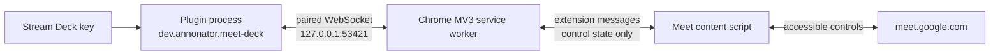

# Architecture

## Purpose and constraints

Meet Deck gives Stream Deck keys reliable, state-synchronised controls for an active Google Meet.
Version 1 supports microphone, camera, raised hand, and the user's own presentation. It is
intentionally local-only: there is no Meet API, OAuth grant, remote backend, cloud relay, analytics,
or telemetry.

The system is split because a Stream Deck plugin cannot inspect a browser tab, while a Chrome
extension cannot receive Stream Deck SDK events directly.

## When built-in controls are enough

If microphone/camera shortcuts in the currently focused Meet tab are sufficient, Stream Deck's
built-in Hotkey or Multi Action is the smaller solution and needs no browser extension. It cannot,
however, know the confirmed Meet state, follow changes made in Meet, safely select among tabs, or
reliably expose the local user's presentation state. Meet Deck is justified by those requirements,
not by replacing a simple shortcut.

Google Meet exposes no supported public API for these interactive in-call controls. The narrow
Meet-only Chrome extension is therefore the component that observes and activates the visible Meet
UI; browser and operating-system consent boundaries remain authoritative.

## Components

- `packages/protocol` (`@meet-deck/protocol`) owns the versioned, strictly validated wire protocol.
  Frames are limited to 16 KiB.
- `apps/streamdeck-plugin` receives key events, hosts the loopback WebSocket, handles
  pairing/authentication, and renders confirmed state on all matching keys. Its public UUID is
  `dev.annonator.meet-deck`.
- `apps/chrome-extension` is a Manifest V3 extension. Its service worker owns the bridge connection.
  A content script runs only on `https://meet.google.com/*`, reads the relevant accessible button
  state, and activates an unambiguous control.

The extension requires only `storage` and `alarms`, plus a Meet-only content-script match. `storage`
keeps the local pairing token and configuration. `alarms` schedules a named wakeup so a suspended
MV3 worker can retry the loopback bridge; the alarm contains only its fixed name and timing, never
meeting or control data. Neither permission grants additional website access. A separate optional
host capability is declared only for `127.0.0.1` and requested from an explicit **Pair and connect**
or **Connect** gesture for the exact configured `ws://127.0.0.1:<configured port>` origin. Chrome
represents that request as `ws://127.0.0.1:<configured port>/*`; the required path marker does not
broaden the scheme, host, or port. It grants no LAN, `localhost`, remote-host, or all-URL access.
The extension does not request `tabs`, `cookies`, `identity`, `webRequest`, `debugger`,
`desktopCapture`, microphone, or camera.

## Data and command flow

1. Each content script transiently checks visible Meet button accessibility labels/state attributes,
   then reports only whether its own document is joined plus its finite control states. Chrome's
   sender URL is used only to validate the exact active top-level Meet origin and is not copied into
   product state.
2. The service worker validates browser-supplied sender/document identity, maintains the tab
   registry, derives `meetingMultiplicity`, and forwards a privacy-minimised snapshot over the
   authenticated loopback connection.
3. The plugin updates its keys only from confirmed snapshots. A key press never changes the
   displayed state optimistically.
4. A key press produces a command with an opaque correlation ID. The content script clicks only a
   single, exact supported control and observes the result.
5. A result and a new state snapshot confirm success or report a bounded failure such as
   `no_meeting`, `ambiguous_target`, `unsupported_ui`, `timeout`, or `needs_user_action`.

The state snapshot contains only `meetingMultiplicity` (`none`, `one`, or `multiple`) and finite
microphone, camera, hand, and `selfPresentation` states. Transport metadata supplies an opaque
random session identifier and monotonic sequence. Neither layer may contain a Meet URL/code, meeting
title, participant data, chat, captions, audio, video, or screen content.

## Target selection and safe failure

Pre-join pages are not active meetings. Exactly one joined meeting is required for control commands.
If two or more joined meetings are detected, Meet Deck returns `ambiguous_target` and clicks
nothing. Missing, duplicated, translated in an unsupported way, or semantically unclear controls
produce `unsupported_ui`; obfuscated CSS class names are not a selector contract.

The content adapter uses button roles and exact supported accessibility names and pressed/state
attributes for English and German Meet. DOM changes are observed, debounced, and re-evaluated after
Meet's single-page navigation.

## Pairing and local transport

The plugin listens only on `127.0.0.1`, default port `53421`. Listening on `0.0.0.0`, a LAN address,
or a public interface is prohibited.

Pairing is closed by default and can open only while the genuine plugin owns the configured
listener. The Stream Deck property inspector opens a two-minute pairing window and displays a random
125-bit, 25-character one-time key. After the same key is entered in the extension popup, the
extension sends only a fresh nonce and its origin. The plugin proves the key over both nonces, the
origin, and fixed roles; only after verifying that proof does the extension return its own
role-separated proof. The key itself never crosses the WebSocket. The plugin then issues a random
256-bit token. Later connections exchange fresh client/server nonces and bind the HMAC-SHA-256 proof
to the random session, exact `chrome-extension://…` origin, and extension/plugin roles. The plugin
also proves possession of the token to the extension. New pairing replaces the previously paired
Chrome profile. Five invalid client proofs close the pairing window until the user explicitly
reopens it.

After authentication, every application message is carried in a `protected` envelope with the
session, direction, strictly increasing per-direction sequence number, and MAC. Command frames are
plugin-to-extension; state/result frames are extension-to-plugin. Nonces and sequences prevent
replay; invalid, oversized, wrong-direction, unknown-version, or structurally unexpected messages
are rejected. Tokens, pairing keys, proofs, and frame MACs must never appear in logs.

The MV3 service worker may be suspended. A heartbeat and bounded exponential reconnect restore the
local session without weakening authentication. Before a foreground pairing or connection attempt,
the popup requests the exact configured `ws://127.0.0.1:<configured port>` origin through Chrome's
optional host-permission API, using `ws://127.0.0.1:<configured port>/*`, only from the **Pair and
connect** or **Connect** gesture. An already-granted matching origin needs no prompt. Denial blocks
that attempt; revocation blocks the next connection or reconnect but is not claimed to close an
already-open WebSocket. Neither state triggers a retry workaround or cloud fallback. Changing the
port requires access for the new exact origin, then cleanup of the superseded exact-port grant.

## Presentation boundary

Starting a presentation can open Meet's share flow, but Chrome and the operating system retain the
final source-selection consent. Meet Deck never chooses or captures a screen, window, or tab. The
user must confirm the browser picker on every start. Cancelling the picker leaves the presentation
state inactive.

If Meet/Chrome blocks programmatic entry into the share flow, Meet Deck returns `needs_user_action`,
focuses the single known Meet tab, and shows the documented Google Meet keyboard shortcut as the
fallback. Once the user's own presentation is active, the extension may activate Meet's explicit
“Stop presenting” control with one key press.

## Compatibility boundary

Version 1 targets macOS, Chrome 147 or newer, Stream Deck 7.1 or newer, and LCD keys. Other Chromium
browsers, Windows, dials, touch strip, and non-English/ non-German Meet variants are outside the
initial compatibility contract.
